# CLAUDE.md

This file provides guidance to Claude Code (claude.ai/code) when working with this repository.

## Project Overview

**northstar.LM** is a client-side web application that transforms meeting recordings, videos, PDFs, images, or text into actionable insights using OpenAI's AI models. The entire application runs client-side with no backend server. Features include multi-meeting orchestration, agent export/import, image OCR with Vision AI, and professional document generation.

## Architecture

```
northstar.LM/
├── index.html          # Main application page (single-page app)
├── orchestrator.html   # Multi-agent orchestrator page
├── northstar-overview.html # Product overview/marketing page
├── manifest.json       # PWA manifest
├── sw.js               # Service worker for offline support
├── css/
│   └── styles.css      # All styling (dark theme with gold accents)
├── js/
│   ├── app.js          # Main application logic (ES Module)
│   └── orchestrator.js # Orchestrator page logic
├── images/
│   ├── k-northstar-logo.png   # Main app logo (northstar.LM)
│   └── orchestrator-logo.png  # Robot mascot logo for Orchestrator
├── archive/            # Legacy files (not in active use)
│   ├── flask-backend/  # Old Flask server code
│   │   ├── app.py
│   │   ├── gunicorn_config.py
│   │   ├── gunicorn_run_readme.rtf
│   │   └── templates/
│   └── static/         # Old static assets (ciao.jpg)
└── .github/
    └── workflows/
        └── deploy.yml  # GitHub Pages deployment
```

## Application Flow Diagram

```mermaid
flowchart TB
    subgraph Browser["🌐 CLIENT BROWSER"]
        direction TB
        
        subgraph Init["Initialization"]
            I1[Load index.html]
            I2[Parse ES Modules]
            I3[Register Service Worker]
            I4[Load API Key from localStorage]
        end

        subgraph Input["Input Handling"]
            IN1[File Upload<br/>audio/video/pdf/image]
            IN2[Text Paste]
            IN3[URL Fetch]
            IN4[Agent Import]
        end

        subgraph Processing["Content Processing"]
            P1[Whisper API<br/>Audio → Text]
            P2[PDF.js<br/>PDF → Text]
            P3[Vision API<br/>Image → Text]
            P4[URL Parser<br/>HTML → Text]
        end

        subgraph State["State Management"]
            S1["state.selectedFile"]
            S2["state.results"]
            S3["state.chatHistory"]
            S4["state.metrics"]
        end

        subgraph UI["UI Updates"]
            U1[KPI Dashboard]
            U2[Results Cards]
            U3[Chat Messages]
            U4[Metrics Panel]
        end
    end

    subgraph OpenAI["☁️ OPENAI API"]
        O1[whisper-1]
        O2[gpt-5.2]
        O3[gpt-5.2-vision]
        O4[gpt-4o-mini-tts]
        O5[gpt-image-1.5]
    end

    I1 --> I2 --> I3 --> I4
    
    IN1 --> P1
    IN1 --> P2
    IN1 --> P3
    IN2 --> S1
    IN3 --> P4
    IN4 --> S2

    P1 <--> O1
    P3 <--> O3

    P1 & P2 & P3 & P4 --> S1
    S1 --> O2
    O2 --> S2
    
    S2 --> U1 & U2
    S3 --> U3
    S4 --> U4

    O4 -.-> |Audio Briefing| S2
    O5 -.-> |Infographic| S2

    style Browser fill:#0a0e17,stroke:#d4a853,color:#fff
    style OpenAI fill:#1a2a1a,stroke:#4ade80,color:#fff
```



## Agent Orchestrator Architecture

```mermaid
flowchart TB
    subgraph OrchestratorPage["🤖 ORCHESTRATOR PAGE"]
        direction TB
        
        subgraph Header["Header & Branding"]
            H1[🤖 Robot Mascot Logo]
            H2[Agent Orchestrator Title]
        end

        subgraph AgentUpload["Agent Upload"]
            AU1[Drag & Drop .md Files]
            AU2[Parse YAML Frontmatter]
            AU3[Extract Sections<br/>summary, keyPoints, actions]
        end

        subgraph KnowledgeBase["Knowledge Base Container"]
            direction LR
            KB1["Agent Node 1<br/>────────────<br/>📋 filename.md<br/>✓ On │ ✕ Remove"]
            KB2["Agent Node 2<br/>────────────<br/>📋 filename.md<br/>○ Off │ ✕ Remove"]
            KB3["Agent Node N<br/>────────────<br/>📋 filename.md<br/>✓ On │ ✕ Remove"]
            
            KB1 ---|connection| KB2
            KB2 ---|connection| KB3
        end

        subgraph AgentState["Agent State"]
            AS1["agent.enabled = true/false"]
            AS2["agent.displayName = editable"]
            AS3["agent.id = unique"]
        end

        subgraph OrchestratorBrain["Orchestrator AI Brain"]
            OB1[Filter Active Agents]
            OB2[buildCombinedContext]
            OB3[GPT-5.2 Query]
        end

        subgraph ChatInterface["Chat Interface"]
            CI1[Welcome Card + Suggestions]
            CI2[User Message Bubble]
            CI3[Thinking Indicator]
            CI4[AI Response Bubble]
        end

        subgraph InsightsGen["Insights Generation"]
            IG1[Common Themes]
            IG2[Trends & Patterns]
            IG3[Risks & Blockers]
            IG4[Recommendations]
            IG5[Consolidated Actions]
        end
    end

    H1 --> H2
    AU1 --> AU2 --> AU3
    AU3 --> KB1 & KB2 & KB3
    KB1 & KB2 & KB3 --> AS1 & AS2 & AS3
    
    AS1 -->|enabled only| OB1
    OB1 --> OB2 --> OB3
    
    OB3 --> CI4
    CI1 --> CI2 --> CI3 --> CI4
    
    OB3 --> IG1 & IG2 & IG3 & IG4 & IG5

    style OrchestratorPage fill:#0a0e17,stroke:#d4a853,color:#fff
    style Header fill:#2a2a1a,stroke:#fbbf24,color:#fff
    style KnowledgeBase fill:#1a1f2e,stroke:#60a5fa,color:#fff
    style OrchestratorBrain fill:#2a1a2a,stroke:#a855f7,color:#fff
```



## Data Flow: Agent Export/Import


## Key Technical Decisions

### Client-Side Only
- No server-side code required - everything runs in the browser
- User provides their own OpenAI API key (stored in localStorage)
- API calls go directly from browser to OpenAI

### OpenAI Models Used
| Purpose | Model |
|---------|-------|
| Audio/Video Transcription | `whisper-1` |
| Text Analysis (Summary, Key Points, Actions, Sentiment) | `gpt-5.2` |
| Image/PDF Vision Analysis (OCR, content extraction) | `gpt-5.2` (vision) |
| Chat with Data (Q&A) | `gpt-5.2` (with reasoning) |
| Text-to-Speech | `gpt-4o-mini-tts` |
| Image Generation | `gpt-image-1.5` |

### Libraries (CDN-loaded)
- **docx.js** (`8.5.0`) - Client-side DOCX generation with professional formatting
- **PDF.js** (`4.0.379`) - Client-side PDF text extraction and page-to-image rendering
- **marked.js** - Markdown parsing for chat message formatting (lists, headings, code blocks)

## Common Development Tasks

### Running Locally
```bash
npx http-server -p 3000
# or
python -m http.server 3000
```

### Cache Busting
When modifying CSS or JS, update the version parameters in HTML files:
```html
<link rel="stylesheet" href="css/styles.css?v=XX">
<script src="js/app.js?v=XX" type="module"></script>
```

### Adding New Features
1. Add HTML elements to `index.html`
2. Add element references in `init()` function's `elements` object
3. Add event listeners in `setupEventListeners()`
4. Implement functionality in `app.js`
5. Add styles to `styles.css`

## State Management

The app uses a simple state object:
```javascript
const state = {
    apiKey: '',
    selectedFile: null,
    selectedPdfFile: null,
    selectedImageFile: null,
    selectedImageBase64: null, // Base64-encoded image for Vision API
    selectedVideoFile: null,
    inputMode: 'audio', // 'audio', 'pdf', 'image', 'video', 'text', or 'url'
    isProcessing: false,
    results: null,        // Contains transcription, summary, keyPoints, actionItems, sentiment
    metrics: null,        // API usage metrics
    chatHistory: [],      // Chat Q&A history
    urlContent: null,
    infographicBlob: null // Generated infographic image
};
```

## Key Functions

### KPI Dashboard
- `updateKPIDashboard()` - Populates the KPI cards at top of results
- Extracts: sentiment, word count, key points count, action items count, read time, topics

### Agent Export/Import
- `downloadAgentFile()` - Exports session as markdown with YAML frontmatter
- `importAgentFile()` - Restores session from exported agent file
- Agent files are portable markdown (~90 KB) containing all analysis data

### Image & Vision Analysis
- `analyzeImageWithVision()` - Sends image to GPT-5.2 Vision for OCR and content extraction
- `renderPdfPagesToImages()` - Converts PDF pages to base64 PNG images using canvas
- `analyzeImageBasedPdf()` - Detects image-based PDFs and processes via Vision API
- `fileToBase64()` - Converts uploaded image files to base64 data URLs

### DOCX Generation
- `downloadDocx()` - Creates professionally formatted Word document
- Includes: cover page, TOC, headers/footers, styled tables, embedded images

### Orchestrator
- `orchestrator.js` - Manages multiple loaded agents
- Cross-meeting chat queries all loaded agent data simultaneously
- Visual Knowledge Base with agent chain visualization
- Each agent is a node with: editable name, enable/disable toggle, remove button
- Only active (enabled) agents are used for chat and insights generation
- Custom robot mascot branding in header (`images/orchestrator-logo.png`)

### Agent Export Modal
- `showAgentNameModal()` - Opens naming dialog before export
- `generateSuggestedAgentName()` - AI-derived name from meeting summary
- `exportAgentWithName(name)` - Creates markdown with user's chosen name
- Agent name stored in YAML frontmatter and used as filename

## API Patterns

### GPT-5.2 Chat Completions
```javascript
// Note: GPT-5.2 requires max_completion_tokens, not max_tokens
body: JSON.stringify({
    model: 'gpt-5.2',
    messages: [...],
    max_completion_tokens: 1000,
    temperature: 0.7
})
```

### Token Tracking
All API calls update `currentMetrics` object for cost calculation:
```javascript
currentMetrics.gptInputTokens += usage.prompt_tokens || 0;
currentMetrics.gptOutputTokens += usage.completion_tokens || 0;
```

## Styling Conventions

- CSS variables defined in `:root` for theming
- Color scheme: Dark navy (`#0a0e17`) with gold accents (`#d4a853`)
- Font families: 'Bebas Neue' for display, 'Source Sans 3' for body
- Animations use CSS transitions and keyframes
- KPI Dashboard uses 6-column responsive grid
- Collapsible sections use native `<details>` elements
- Chat messages use styled markdown with gold arrow markers for lists, gold headings, styled code blocks and blockquotes
- Custom branding: 
  - Main app logo (`images/k-northstar-logo.png`)
  - Robot mascot logo for Orchestrator page (`images/orchestrator-logo.png`)

## UI Components

### KPI Dashboard
```html
<div class="kpi-dashboard">
    <div class="kpi-item">
        <span class="kpi-icon">📊</span>
        <div class="kpi-content">
            <span class="kpi-label">Label</span>
            <span class="kpi-value" id="kpi-xxx">--</span>
        </div>
    </div>
</div>
```

### Collapsible Sections
```html
<details class="result-card">
    <summary class="card-header card-header-collapsible">
        <h3>Title</h3>
        <span class="collapse-toggle">▼</span>
    </summary>
    <div class="card-content">...</div>
</details>
```

### Collapsible Setup Section
The "Setup & Input" section (API key + input) uses a `<details>` element that:
- Auto-collapses after analysis completes (in `displayResults()`)
- Auto-expands when starting new analysis (in `resetForNewAnalysis()`)
- Can be manually toggled by clicking the header

```html
<details class="setup-section" id="setup-section" open>
    <summary class="setup-header">
        <span class="setup-icon">⚙️</span>
        <span class="setup-title">Setup & Input</span>
        <span class="setup-toggle">▼</span>
    </summary>
    <div class="setup-content">...</div>
</details>
```

## Deployment

Automatic deployment via GitHub Actions on push to `main` branch. 

**URLs:**
- Main App: https://mjamiv.github.io/vox2txt/
- Orchestrator: https://mjamiv.github.io/vox2txt/orchestrator.html

### Files Deployed
The GitHub Actions workflow copies these to `_site`:
- `index.html`, `orchestrator.html`, `northstar-overview.html`
- `css/`, `js/`, `images/`
- `manifest.json`, `sw.js` (PWA files)

Note: The `archive/` folder is NOT deployed—it contains legacy Flask backend code for reference only.
