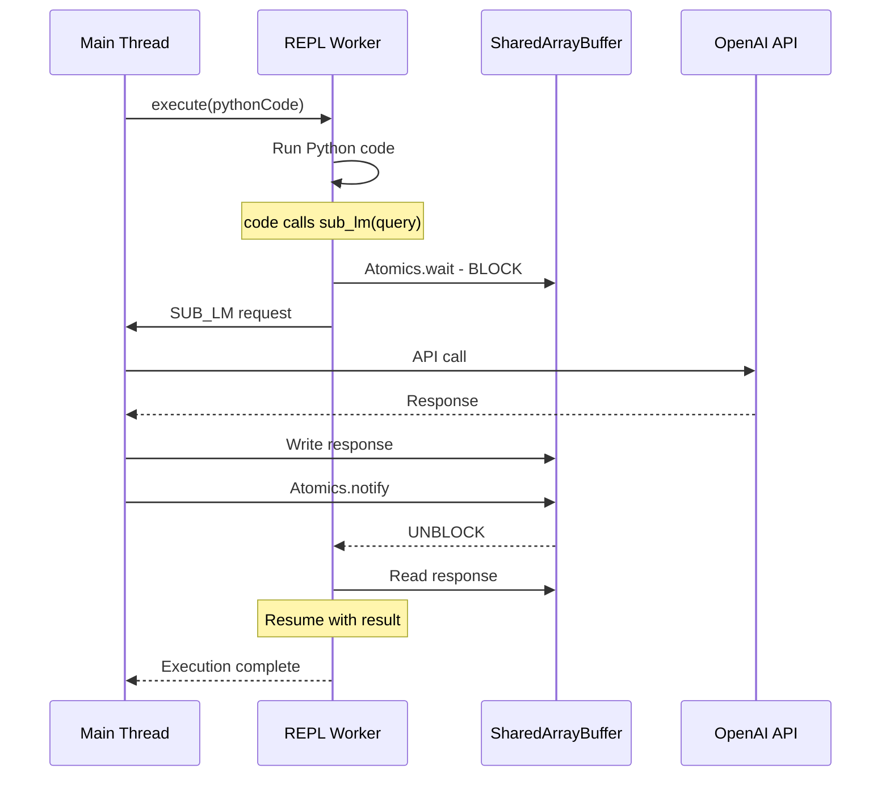

# CLAUDE.md

This file provides guidance to Claude Code (claude.ai/code) when working with this repository.

## Project Overview

**northstar.LM** is a client-side web application that transforms meeting recordings, videos, PDFs, images, or text into actionable insights using OpenAI's AI models. The entire application runs client-side with no backend server.

The application consists of two main pages:
- **Agent Builder** (`index.html`) - Analyzes individual meetings and exports them as agents
- **Agent Orchestrator** (`orchestrator.html`) - Combines multiple agents for cross-meeting insights using the RLM pipeline

Features include multi-meeting orchestration, agent export/import, image OCR with Vision AI, and professional document generation.

## Recent Updates

### January 2026
- **Bug Fixes:**
  - Fixed orchestrator file upload button double-trigger issue by removing conflicting `for` attribute and JS click handler
  - Fixed JavaScript syntax error: nullish coalescing (`??`) mixed with logical OR (`||`) requires parentheses
  - Added fallback handlers with longer timeout (1500ms) for slower module loading
  - Improved accessibility with ARIA labels and `role="button"` on upload zone

- **RLM Optimizations:**
  - Query decomposer now emits `intent`, `dataPreference`, and `formatConstraints` for intelligent routing
  - Early-stop heuristics skip full RLM pipeline when retrieval returns few slices
  - Eval harness scaffold added for quality benchmarking (`js/rlm/eval-harness.js`)
  - Stage B retrieval scoring applies redundancy penalty to down-rank frequently retrieved slices
  - Retrieval slices, prompt templates, and context slices are cached to reduce repeated work
  - Query cache keys include a corpus stamp to avoid stale hits after agent changes
  - Parallel/map-reduce sub-queries run via a worker pool (max concurrency bumped to 4)
  - Shadow prompt diagnostics run asynchronously so hybrid mode doesn't block responses
  - Model tiering uses GPT-5-mini for sub-queries and REPL sub_lm calls when GPT-5.2 is selected
  - Summary prompts cap sub-query fan-out and use a lighter retrieval preset to reduce tail latency
  - Per-stage timing telemetry (decompose/retrieve/execute/aggregate/shadow) appears in metrics and CSV export
- Memory debug shows retrieval cache hit rate for cache discipline checks
- Test runs capture canonical prompt-set metadata in analytics and HTML exports
- GPT-5 fallback logging now normalizes versioned names so Claude only reports tier changes when the API actually falls back to a different GPT-5 class (avoids repeated warnings from `gpt-5-mini-<date>` responses)

- **Core Features:**
  - Agent export embeds a full JSON payload (processing metadata, prompts, metrics, chat history, artifacts, attachments) with a stable agent ID
  - Agent import prefers the embedded payload for restoring session metadata; the Orchestrator builds `extendedContext` from a sanitized payload (base64 stripped) for richer search/context/REPL usage
  - GitHub Pages deployment now copies optional asset folders (`images/`, `flowcharts/`, `static/`) when present to avoid build failures

## Architecture

```
northstar.LM/
├── index.html          # Agent Builder - main single-page app
├── orchestrator.html   # Agent Orchestrator - multi-agent analysis
├── northstar-overview.html # Product overview/marketing page
├── manifest.json       # PWA manifest
├── sw.js               # Service worker for offline support
├── css/
│   └── styles.css      # All styling (dark theme with gold accents)
├── js/
│   ├── app.js          # Main application logic (ES Module)
│   ├── orchestrator.js # Orchestrator page logic (uses RLM)
│   └── rlm/            # RLM-Lite module (Recursive Language Model)
│       ├── index.js        # Main entry point & RLMPipeline class
│       ├── context-store.js    # Agent data as queryable variables
│       ├── query-decomposer.js # Query analysis & sub-query generation
│       ├── sub-executor.js     # Parallel execution engine
│       └── aggregator.js       # Response synthesis & merging
├── images/
│   ├── k-northstar-logo.png   # Main app logo (northstar.LM)
│   └── orchestrator-logo.png  # Robot mascot logo for Orchestrator
├── archive/            # Legacy files (not in active use)
│   ├── flask-backend/  # Old Flask server code
│   │   ├── app.py
│   │   ├── gunicorn_config.py
│   │   ├── gunicorn_run_readme.rtf
│   │   └── templates/
│   └── static/         # Old static assets (ciao.jpg)
└── .github/
    └── workflows/
        └── deploy.yml  # GitHub Pages deployment
```

## Application Flow Diagram

```mermaid
flowchart TB
    subgraph Browser["🌐 CLIENT BROWSER - northstar.LM"]
        direction TB
        
        subgraph Init["🚀 Initialization"]
            I1[Load index.html]
            I2[Register Service Worker<br/>PWA Support]
            I3[Load API Key from<br/>localStorage]
        end

        subgraph InputTabs["📥 Input Methods"]
            direction LR
            IN1[🎤 Audio<br/>MP3/WAV/M4A]
            IN2[📄 PDF<br/>Text & Scanned]
            IN3[📷 Image<br/>JPG/PNG/WebP]
            IN4[🎥 Video<br/>MP4/WebM]
            IN5[📝 Text<br/>Paste/Type]
            IN6[🌐 URL<br/>Web Scrape]
            IN7[⌚ Wearable<br/>Coming Soon]
            IN8[📥 Agent Import<br/>.md Files]
        end

        subgraph Processing["⚙️ Content Processing"]
            P1[Whisper API<br/>Audio/Video → Text]
            P2[PDF.js + Vision<br/>PDF → Text]
            P3[Vision API<br/>Image → Text]
            P4[URL Parser<br/>HTML → Text]
        end

        subgraph Analysis["🧠 AI Analysis Pipeline"]
            A1[GPT-5.2<br/>Generate Summary]
            A2[GPT-5.2<br/>Extract Key Points]
            A3[GPT-5.2<br/>Identify Actions]
            A4[GPT-5.2<br/>Sentiment Analysis]
        end

        subgraph State["💾 State Management"]
            S1["state.results<br/>{summary, keyPoints, actions, sentiment}"]
            S2["state.chatHistory[]"]
            S3["currentMetrics<br/>{tokens, costs, apiCalls}"]
        end

        subgraph Output["📊 Output & Features"]
            direction LR
            O1[📈 KPI Dashboard<br/>6 metrics]
            O2[📋 Results Cards<br/>Collapsible]
            O3[💬 Chat with Data<br/>GPT-5.2]
            O4[🔊 Audio Briefing<br/>TTS]
            O5[🎨 Infographic<br/>DALL-E]
            O6[📄 DOCX Export<br/>Professional]
            O7[🤖 Agent Export<br/>.md File]
        end

        subgraph Reset["🔄 New Analysis"]
            R1[resetForNewAnalysis]
            R2[Clear all state]
            R3[Reset UI elements]
            R4[Clear file inputs]
        end
    end

    subgraph OpenAI["☁️ OPENAI API"]
        API1[whisper-1<br/>Transcription]
        API2[gpt-5.2<br/>Analysis & Chat]
        API3[gpt-5.2 Vision<br/>Image/PDF OCR]
        API4[gpt-4o-mini-tts<br/>Text-to-Speech]
        API5[gpt-image-1.5<br/>Image Generation]
    end

    subgraph Orchestrator["🎭 Agent Orchestrator"]
        ORC[orchestrator.html<br/>Multi-agent insights]
    end

    I1 --> I2 --> I3
    
    IN1 & IN4 --> P1
    IN2 --> P2
    IN3 --> P3
    IN6 --> P4
    IN5 --> Analysis
    IN8 --> S1

    P1 <--> API1
    P2 <-.-> API3
    P3 <--> API3

    P1 & P2 & P3 & P4 --> Analysis
    
    Analysis --> A1 & A2 & A3 & A4
    A1 & A2 & A3 & A4 <--> API2
    A1 & A2 & A3 & A4 --> S1

    S1 --> O1 & O2
    S2 --> O3
    S3 --> O6
    
    O3 <--> API2
    O4 <--> API4
    O5 <--> API5
    
    O7 --> ORC
    R1 --> R2 --> R3 --> R4 --> InputTabs

    style Browser fill:#0a0e17,stroke:#d4a853,color:#fff
    style OpenAI fill:#1a2a1a,stroke:#4ade80,color:#fff
    style Orchestrator fill:#1a1a2a,stroke:#a855f7,color:#fff
    style Reset fill:#2a1a1a,stroke:#ef4444,color:#fff
```



## Agent Orchestrator Architecture

```mermaid
flowchart TB
    subgraph MainApp["📱 MAIN APP (index.html)"]
        MA1[Complete Analysis]
        MA2[Export Agent Button]
        MA3[Name Modal]
        MA4[Download .md File]
        
        MA1 --> MA2 --> MA3 --> MA4
    end

    subgraph OrchestratorPage["🎭 AGENT ORCHESTRATOR (orchestrator.html)"]
        direction TB
        
        subgraph Header["🤖 Header"]
            H1[Robot Mascot Logo]
            H2[Agent Orchestrator]
            H3[API Key Input]
        end

        subgraph Upload["📤 Agent Upload Zone"]
            UP1[Drag & Drop<br/>.md Files]
            UP2[Multi-file Support]
            UP3[parseAgentFile]
        end

        subgraph Parsing["⚙️ File Parsing"]
            PA1[Parse YAML Frontmatter<br/>version, created, source_type, agent_name]
            PA2[Extract Sections]
            PA3["summary<br/>keyPoints<br/>actionItems<br/>sentiment<br/>transcript"]
        end

        subgraph KnowledgeBase["🧠 Knowledge Base Visual Chain"]
            direction LR
            KB1["🟢 Agent 1<br/>────────<br/>Q4 Planning<br/>Jan 10, 2026<br/>✓ Enabled"]
            KB2["🟢 Agent 2<br/>────────<br/>Team Sync<br/>Jan 11, 2026<br/>✓ Enabled"]
            KB3["⚪ Agent 3<br/>────────<br/>Review<br/>Jan 12, 2026<br/>○ Disabled"]
            
            KB1 -.-|dotted link| KB2
            KB2 -.-|dotted link| KB3
        end

        subgraph StateManagement["💾 State"]
            ST1["state.agents[]"]
            ST2["state.insights"]
            ST3["state.chatHistory[]"]
            ST4["state.apiKey"]
        end

        subgraph ChatUI["💬 Orchestrator Chat"]
            CH1[Welcome Message<br/>+ Quick Actions]
            CH2[📋 Key action items]
            CH3[🔗 Common themes]
            CH4[✅ Main decisions]
            CH5[User Query Input]
            CH6[Thinking Indicator<br/>with status updates]
            CH7[AI Response<br/>Markdown formatted]
        end

        subgraph InsightsButton["📊 Generate Cross-Meeting Insights"]
            IB1{2+ agents enabled<br/>+ API key?}
            IB2[Button Disabled]
            IB3[generateCrossInsights]
        end

        subgraph InsightsGen["📊 Cross-Meeting Insights Panel"]
            IG1[🔗 Common Themes]
            IG2[📈 Trends & Patterns]
            IG3[⚠️ Risks & Blockers]
            IG4[💡 Recommendations]
            IG5[✅ Consolidated Actions]
        end

        subgraph APICall["☁️ GPT-5.2 API"]
            API1[buildCombinedContext<br/>All enabled agents]
            API2[System Prompt<br/>Business Analyst]
            API3[JSON Response<br/>Parse & Display]
        end
    end

    MA4 -->|.md file| UP1
    
    H1 --> H2
    H3 --> ST4
    
    UP1 --> UP2 --> UP3
    UP3 --> PA1 --> PA2 --> PA3
    PA3 --> ST1
    ST1 --> KB1 & KB2 & KB3
    
    KB1 & KB2 --> ST1
    
    CH1 --> CH2 & CH3 & CH4
    CH2 & CH3 & CH4 --> CH5
    CH5 --> CH6 --> CH7
    CH5 --> API1
    
    IB1 -->|No| IB2
    IB1 -->|Yes| IB3
    IB3 --> API1
    API1 --> API2 --> API3
    API3 --> ST2
    ST2 --> IG1 & IG2 & IG3 & IG4 & IG5
    
    API3 --> CH7
    ST3 --> CH7

    style MainApp fill:#1a2a1a,stroke:#4ade80,color:#fff
    style OrchestratorPage fill:#0a0e17,stroke:#d4a853,color:#fff
    style KnowledgeBase fill:#1a1f2e,stroke:#60a5fa,color:#fff
    style InsightsGen fill:#1a2a2a,stroke:#22d3ee,color:#fff
    style APICall fill:#2a1a2a,stroke:#a855f7,color:#fff
    style ChatUI fill:#2a2a1a,stroke:#fbbf24,color:#fff
```



## RLM-Lite Architecture (Recursive Language Model)

The orchestrator uses RLM-Lite for intelligent query processing. Based on the paper "Recursive Language Models" by Zhang, Kraska & Khattab (arXiv:2512.24601).

### RLM Decision Flow


### RLM Pipeline Flow


### RLM Map-Reduce Example

```mermaid
flowchart TB
    subgraph Query["📥 User Query"]
        Q["What are all the action items<br/>blocking progress?"]
    end

    subgraph Decompose["1️⃣ DECOMPOSE"]
        DC[Intent: AGGREGATIVE<br/>Strategy: MAP-REDUCE]
    end

    subgraph Map["2️⃣ MAP PHASE (Parallel)"]
        M1["Agent: Q4 Planning<br/>─────────────<br/>Extract blocking items"]
        M2["Agent: Sprint Review<br/>─────────────<br/>Extract blocking items"]
        M3["Agent: Team Sync<br/>─────────────<br/>Extract blocking items"]
    end

    subgraph Results["SUB-RESULTS"]
        R1["Budget approval pending"]
        R2["Testing env not ready"]
        R3["Hiring delayed"]
    end

    subgraph Reduce["3️⃣ REDUCE PHASE"]
        RD[Synthesize all blockers<br/>into coherent response]
    end

    subgraph Output["📤 FINAL RESPONSE"]
        O["Based on 3 meetings:<br/>• Budget approval (Q4 Planning)<br/>• Testing environment (Sprint)<br/>• Hiring decision (Team Sync)"]
    end

    Q --> DC
    DC --> M1 & M2 & M3
    M1 --> R1
    M2 --> R2
    M3 --> R3
    R1 & R2 & R3 --> RD
    RD --> O

    style Query fill:#1a1f2e,stroke:#60a5fa,color:#fff
    style Decompose fill:#1a2a1a,stroke:#4ade80,color:#fff
    style Map fill:#1a1a2a,stroke:#a855f7,color:#fff
    style Reduce fill:#2a1a1a,stroke:#ef4444,color:#fff
    style Output fill:#2a2a1a,stroke:#fbbf24,color:#fff
```



### RLM Components

| Component | File | Purpose |
|-----------|------|---------|
| **RLMPipeline** | `index.js` | Main orchestration class tying all components together |
| **ContextStore** | `context-store.js` | Stores agent data as queryable variables with search indexing |
| **QueryDecomposer** | `query-decomposer.js` | Analyzes queries, classifies intent/dataPreference/formatConstraints, generates sub-queries |
| **SubExecutor** | `sub-executor.js` | Runs sub-queries in parallel with concurrency control |
| **Aggregator** | `aggregator.js` | Merges sub-responses into coherent final answer with early-stop detection |
| **MemoryStore** | `memory-store.js` | Signal-weighted memory with focus episodes, Stage A/B retrieval scoring |
| **PromptBuilder** | `prompt-builder.js` | Assembles prompts with token budgeting (state block + working window + retrieved slices) |
| **QueryCache** | `query-cache.js` | Caches query results with TTL and similarity matching |
| **EvalHarness** | `eval-harness.js` | Quality benchmarking scaffold for rubric-based evaluation |
| **REPLEnvironment** | `repl-environment.js` | Manages Pyodide Web Worker for Python code execution |
| **REPLWorker** | `repl-worker.js` | Web Worker running sandboxed Python via Pyodide with sync sub_lm |
| **CodeGenerator** | `code-generator.js` | LLM prompts for Python code generation and output parsing |

### Query Strategies

| Strategy | When Used | How It Works |
|----------|-----------|--------------|
| **direct** | Simple queries, ≤2 agents | Single LLM call with combined context |
| **parallel** | Comparative queries | One sub-query per agent, run concurrently |
| **map-reduce** | Aggregate queries (all/every/across) | Map: query each agent → Reduce: synthesize results |
| **iterative** | Exploratory queries | Initial query → followup if uncertain |

### RLM Configuration

```javascript
const RLM_CONFIG = {
    maxSubQueries: 5,        // Max sub-queries per decomposition
    summaryMaxSubQueries: 4, // Cap fan-out for full-scope summaries
    maxConcurrent: 4,        // Parallel execution limit
    maxDepth: 2,             // Max recursion depth for sub_lm calls
    tokensPerSubQuery: 800,  // Token budget per sub-query
    enableLLMSynthesis: true,// Use LLM to synthesize results
    enableREPL: true,        // Enable REPL-based code execution
    replTimeout: 30000,      // REPL execution timeout (30s)
    subLmTimeout: 60000,     // Timeout for sub_lm calls (60s)
    autoInitREPL: false,     // Auto-initialize REPL on first use
    preferREPL: false,       // Prefer REPL over decomposition
    enableSyncSubLm: true    // Enable synchronous sub_lm
};
```

### REPL Environment (Phase 1)

The RLM includes a Python REPL environment powered by Pyodide:

**Architecture:**
- Web Worker sandbox for isolated Python execution
- Pyodide loaded lazily (~10MB, cached by browser)
- Context stored as Python variable for programmatic access
- LLM generates Python code to analyze meeting data

**Available Python API:**
```python
context        # Dict with all meeting data
partition(text, chunk_size)  # Split text into chunks
grep(pattern, text)          # Regex search with context
search_agents(keyword)       # Search all agents
get_agent(agent_id)          # Get specific agent
list_agents()                # List all agents
get_all_action_items()       # Extract all action items
get_all_summaries()          # Get all summaries
sub_lm(query, context)       # Synchronous recursive LLM call
FINAL(answer)                # Return final answer
FINAL_VAR(var_name)          # Return variable as answer
```

**When REPL is used:**
- Queries with: search, find, grep, list all, count, filter, sort, combine
- Pipeline routes to `processWithREPL()` instead of decomposition

### True Recursion (Phase 2) ✅

Phase 2 adds synchronous `sub_lm()` calls that enable true recursive reasoning:

**Architecture Diagram:**


**Key Features:**
- **SharedArrayBuffer Sync**: Uses `Atomics.wait()` for true blocking in Web Worker
- **Depth Tracking**: MAX_DEPTH = 2 prevents infinite recursion
- **Unified Service Worker**: `sw.js` injects COOP/COEP headers for SharedArrayBuffer on GitHub Pages
- **Async Fallback**: Graceful degradation when SharedArrayBuffer unavailable

### Enhanced Train of Thought (Phase 2.3) ✅

The chat displays detailed real-time progress during query processing:

```mermaid
flowchart TB
    subgraph ThinkingUI["🤖 Train of Thought Display"]
        direction TB
        T1["🏷️ Query: What decisions were made?"]
        T2["🏷️ Mode: REPL with 3 agents"]
        T3["🏷️ Query type: AGGREGATIVE"]
        T4["🐍 Generating Python code..."]
        T5["✓ Code generated"]
        T6["⚡ Executing in Pyodide..."]
        T7["✓ Execution complete"]
        T8["📊 Extracting FINAL answer"]
        T9["✓ Response ready"]
        
        T1 --> T2 --> T3 --> T4 --> T5 --> T6 --> T7 --> T8 --> T9
    end
    
    subgraph Pipeline["RLM Pipeline"]
        P1[setProgressCallback]
        P2[_emitProgress]
    end
    
    Pipeline -->|real-time updates| ThinkingUI
```



**Step Types:**
| Icon | Type | Color | Description |
|------|------|-------|-------------|
| 🏷️ | classify | Purple | Query classification |
| 🔀 | decompose | Blue | Query decomposition |
| 🐍 | code | Green | Code generation |
| ⚡ | execute | Amber | Execution |
| 🔄 | recurse | Pink | Recursive LLM calls |
| 📊 | aggregate | Cyan | Result aggregation |
| ✓ | success | Bright green | Completion |
| ⚠️ | warning | Orange | Warnings |

**Query Classification (Phase 2.1):**
```javascript
QueryType = {
    FACTUAL,      // Simple fact-finding
    AGGREGATIVE,  // Gather across meetings
    COMPARATIVE,  // Compare meetings
    SEARCH,       // Find specific content
    RECURSIVE     // Complex analysis requiring sub_lm
};
```

**Example Recursive Code:**
```python
# Python code generated by LLM
summaries = get_all_summaries()
analysis = sub_lm("What patterns emerge?", summaries)  # Blocks until LLM responds
if "budget" in analysis.lower():
    followup = sub_lm("Elaborate on budget", analysis)  # Can chain calls!
    FINAL(f"Budget Analysis: {followup}")
else:
    FINAL(f"General Analysis: {analysis}")
```

### Future Enhancements

Completed optimizations:
- ✅ Query caching with TTL and similarity matching (`query-cache.js`)
- ✅ Retrieval/prompt/context caching for RLM prompt assembly
- ✅ Token budgeting and prompt guardrails
- ✅ Progress indicators during query processing (train of thought display)
- ✅ Intent-based routing with data preference classification
- ✅ Early-stop heuristics for low-slice retrievals
- ✅ Summary fan-out caps and lighter retrieval presets for full-scope summaries
- ✅ Parallel sub-query worker pool (max concurrency 4)
- ✅ Async shadow prompt diagnostics to avoid blocking hybrid responses
- ✅ Model tiering for sub-queries and REPL sub_lm (GPT-5-mini with GPT-5.2)
- ✅ Stage timing telemetry in metrics/CSV and retrieval cache hit-rate visibility

Remaining items:
- Eval harness rubric scoring and regression reports
- A/B testing framework for RLM vs Direct mode

## Data Flow: Agent Export/Import


Exported markdown now includes an **Export Payload (JSON)** section with processing metadata, prompts, metrics, chat history, and artifact metadata/attachments. On import, the single-meeting app and Orchestrator prefer this payload when present; the Orchestrator sanitizes base64 attachments and stores the remainder in `extendedContext` for search, context slices, and REPL analysis.

## Key Technical Decisions

### Client-Side Only
- No server-side code required - everything runs in the browser
- User provides their own OpenAI API key (stored in localStorage)
- API calls go directly from browser to OpenAI

### OpenAI Models Used
| Purpose | Model |
|---------|-------|
| Audio/Video Transcription | `whisper-1` |
| Text Analysis (Summary, Key Points, Actions, Sentiment) | `gpt-5.2` |
| Image/PDF Vision Analysis (OCR, content extraction) | `gpt-5.2` (vision) |
| Chat with Data (Q&A) | `gpt-5.2` (with reasoning) |
| Text-to-Speech | `gpt-4o-mini-tts` |
| Image Generation | `gpt-image-1.5` |

### Libraries (CDN-loaded)
- **docx.js** (`8.5.0`) - Client-side DOCX generation with professional formatting
- **PDF.js** (`4.0.379`) - Client-side PDF text extraction and page-to-image rendering
- **marked.js** - Markdown parsing for chat message formatting (lists, headings, code blocks)
- **Pyodide** (`0.25.0`) - In-browser Python runtime for REPL code execution (loaded lazily in Web Worker)

## Common Development Tasks

### Running Locally
```bash
npx http-server -p 3000
# or
python -m http.server 3000
```

### Cache Busting
When modifying CSS or JS, update the version parameters in HTML files:
```html
<link rel="stylesheet" href="css/styles.css?v=XX">
<script src="js/app.js?v=XX" type="module"></script>
```

### Adding New Features
1. Add HTML elements to `index.html`
2. Add element references in `init()` function's `elements` object
3. Add event listeners in `setupEventListeners()`
4. Implement functionality in `app.js`
5. Add styles to `styles.css`

## State Management

The app uses a simple state object:
```javascript
const state = {
    apiKey: '',
    selectedFile: null,
    selectedPdfFile: null,
    selectedImageFile: null,
    selectedImageBase64: null, // Base64-encoded image for Vision API
    selectedVideoFile: null,
    inputMode: 'audio', // 'audio', 'pdf', 'image', 'video', 'text', or 'url'
    isProcessing: false,
    results: null,        // Contains transcription, summary, keyPoints, actionItems, sentiment
    metrics: null,        // API usage metrics
    chatHistory: [],      // Chat Q&A history
    sourceUrl: null,
    exportMeta: {
        agentId: null,
        source: { audio: null, pdf: null, image: null, video: null, url: null },
        processing: {
            inputMode: null,
            analysis: null,
            transcriptionMethod: null,
            pdf: { totalPages: null, usedVisionOcr: false, ocrPagesAnalyzed: 0, ocrPageLimit: 0 }
        },
        artifacts: { audioBriefing: null, infographic: null }
    },
    urlContent: null
};
```

## Key Functions

### KPI Dashboard
- `updateKPIDashboard()` - Populates the KPI cards at top of results
- Extracts: sentiment, word count, key points count, action items count, read time, topics

### Agent Export/Import
- `buildExportPayload()` / `exportAgentWithName()` - Build markdown with YAML frontmatter and embedded Export Payload JSON (processing metadata, prompts, metrics, chat history, artifacts, attachments)
- `parseAgentFile()` - Extracts markdown sections plus Export Payload JSON when present (used in both apps)
- `importAgentSession()` - Restores session state from payload (source metadata, processing details, metrics, chat history, artifacts)
- Orchestrator sanitizes base64 attachments and stores remaining payload as `extendedContext`

### Image & Vision Analysis
- `analyzeImageWithVision()` - Sends image to GPT-5.2 Vision for OCR and content extraction
- `renderPdfPagesToImages()` - Converts PDF pages to base64 PNG images using canvas
- `analyzeImageBasedPdf()` - Detects image-based PDFs and processes via Vision API
- `fileToBase64()` - Converts uploaded image files to base64 data URLs

### DOCX Generation
- `downloadDocx()` - Creates professionally formatted Word document
- Includes: cover page, TOC, headers/footers, styled tables, embedded images

### Orchestrator
- `orchestrator.js` - Manages multiple loaded agents
- **RLM-Lite powered**: Uses Recursive Language Model for intelligent query processing
- Cross-meeting chat uses query decomposition and parallel execution
- Visual Knowledge Base with agent chain visualization
- Each agent is a node with: editable name, enable/disable toggle, remove button
- Only active (enabled) agents are used for chat and insights generation
- Custom robot mascot branding in header (`images/orchestrator-logo.png`)
- **Model Settings Panel**: Select model (GPT-5.2, GPT-5-mini, GPT-5-nano), configure effort level, toggle RLM
- **Enhanced Metrics System**:
  - Per-prompt detailed logging with response storage
  - Confidence tracking via logprobs (GPT-5.2 with effort='none' only)
  - CSV export functionality for offline analysis
  - Stage timing telemetry (decompose/retrieve/execute/aggregate/shadow) in prompt logs and CSV
  - Auto-collapse with pin option
- Key RLM functions:
  - `chatWithRLM()` - Process queries through RLM pipeline
  - `syncAgentsToRLM()` - Keep RLM context store in sync with state
  - `shouldUseRLM()` - Determine if RLM should be used for a query
  - `downloadMetricsCSV()` - Export metrics as CSV file

### Agent Export Modal
- `showAgentNameModal()` - Opens naming dialog before export
- `generateSuggestedAgentName()` - AI-derived name from meeting summary
- `exportAgentWithName(name)` - Creates markdown with user's chosen name
- Agent name stored in YAML frontmatter and used as filename

## API Patterns

### GPT-5.2 Chat Completions
```javascript
// Note: GPT-5.2 requires max_completion_tokens, not max_tokens
// IMPORTANT: logprobs only work when effort is 'none'
// When using reasoning_effort, logprobs are NOT supported
body: JSON.stringify({
    model: 'gpt-5.2',
    messages: [...],
    max_completion_tokens: 1000,
    temperature: 1,  // Only when effort is 'none'
    reasoning_effort: 'medium',  // 'none', 'low', 'medium', 'high', 'xhigh'
    logprobs: true,  // Only when effort is 'none'
    top_logprobs: 1
})
```

### Token Tracking & Metrics
All API calls update `currentMetrics` object for cost calculation:
```javascript
currentMetrics.gptInputTokens += usage.prompt_tokens || 0;
currentMetrics.gptOutputTokens += usage.completion_tokens || 0;
```

**Enhanced Metrics System (Orchestrator):**
- Per-prompt logging with full response storage
- Grouped metrics for RLM/REPL queries (aggregates sub-calls)
- Stage timing telemetry (decompose/retrieve/execute/aggregate/shadow) in prompt logs and CSV
- Confidence metrics via logprobs (when available)
- CSV export with all prompt data including responses
- Metrics card with auto-collapse and pin functionality

## Styling Conventions

- CSS variables defined in `:root` for theming
- Color scheme: Dark navy (`#0a0e17`) with gold accents (`#d4a853`)
- Font families: 'Bebas Neue' for display, 'Source Sans 3' for body
- Animations use CSS transitions and keyframes
- KPI Dashboard uses 6-column responsive grid
- Collapsible sections use native `<details>` elements
- Chat messages use styled markdown with gold arrow markers for lists, gold headings, styled code blocks and blockquotes
- Custom branding: 
  - Main app logo (`images/k-northstar-logo.png`)
  - Robot mascot logo for Orchestrator page (`images/orchestrator-logo.png`)

## UI Components

### KPI Dashboard
```html
<div class="kpi-dashboard">
    <div class="kpi-item">
        <span class="kpi-icon">📊</span>
        <div class="kpi-content">
            <span class="kpi-label">Label</span>
            <span class="kpi-value" id="kpi-xxx">--</span>
        </div>
    </div>
</div>
```

### Collapsible Sections
```html
<details class="result-card">
    <summary class="card-header card-header-collapsible">
        <h3>Title</h3>
        <span class="collapse-toggle">▼</span>
    </summary>
    <div class="card-content">...</div>
</details>
```

### Collapsible Setup Section
The "Setup & Input" section (API key + input) uses a `<details>` element that:
- Auto-collapses after analysis completes (in `displayResults()`)
- Auto-expands when starting new analysis (in `resetForNewAnalysis()`)
- Can be manually toggled by clicking the header

```html
<details class="setup-section" id="setup-section" open>
    <summary class="setup-header">
        <span class="setup-icon">⚙️</span>
        <span class="setup-title">Setup & Input</span>
        <span class="setup-toggle">▼</span>
    </summary>
    <div class="setup-content">...</div>
</details>
```

## Deployment

Automatic deployment via GitHub Actions on push to `main` branch. 

**URLs:**
- Main App: https://mjamiv.github.io/vox2txt/
- Orchestrator: https://mjamiv.github.io/vox2txt/orchestrator.html

### Files Deployed
The GitHub Actions workflow copies these to `_site`:
- `index.html`, `orchestrator.html`
- `css/`, `js/` (including `js/rlm/`)
- `manifest.json`, `sw.js` (PWA files)
- Optional asset folders when present: `images/`, `flowcharts/`, `static/`

Note: The `archive/` folder is NOT deployed-it contains legacy Flask backend code for reference only.
