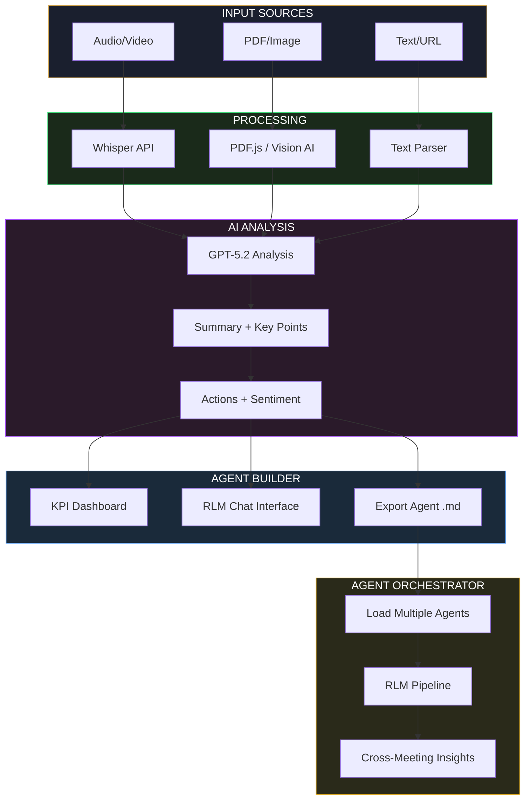

# northstar.LM

> Transform meetings into actionable insights with AI

**Live Demo:** [https://mjamiv.github.io/vox2txt/](https://mjamiv.github.io/vox2txt/)

---

## Overview

northstar.LM is a client-side web application that uses OpenAI's AI models to analyze meeting content and enable intelligent cross-meeting queries. All processing happens in your browser with your own API key—no server-side data handling.

| Application | Purpose |
|-------------|---------|
| **[Agent Builder](https://mjamiv.github.io/vox2txt/)** | Process recordings, videos, documents, images, or text into AI agents with summaries, key points, action items, and sentiment analysis |
| **[Agent Orchestrator](https://mjamiv.github.io/vox2txt/orchestrator.html)** | Combine multiple agents for cross-meeting analysis using the RLM pipeline |

---

## Key Capabilities

### Agent Builder
- **Multi-format Input**: Audio (MP3, WAV, M4A), Video (MP4, WebM), PDF, Images, Text, URLs
- **AI Analysis**: Summaries, key points, action items, sentiment analysis via GPT-5.2
- **RLM-Powered Chat**: Direct/RLM toggle for chat and agenda generation (defaults to RLM)
- **Audio Briefing**: 2-minute executive summaries with customizable TTS voices
- **Meeting Infographic**: AI-generated visual summaries via GPT-Image-1.5
- **Professional Export**: DOCX reports and portable agent files (.md)

### Agent Orchestrator
- **Multi-Agent Analysis**: Load and query multiple meeting agents simultaneously
- **RLM Pipeline**: Intelligent query decomposition with source attribution
- **Processing Modes**: Direct Chat, RLM + Signal-Weighted Memory, or RLM + Hybrid Focus
- **Knowledge Base Canvas**: Interactive visualization with agent grouping and filtering
- **Comprehensive Metrics**: Token usage, costs, response times, and CSV export

---

## RLM Validation Results (January 2026)

Comprehensive stress testing validates RLM's ability to maintain conversation context across extended sessions.

### Response Capability

| Test | Direct Chat | RLM | Improvement |
|------|-------------|-----|-------------|
| **25-Question** | 80% | 100% | +25% |
| **50-Question** | 35% | 96% | +174% |
| **100-Question** | 18% | 96% | +433% |

**Critical Finding:** Direct Chat loses access to earlier conversation turns by Turn 7-10. RLM maintains **95-96% response capability** through 100+ turns by re-querying source agents.

### Cost & Performance

| Mode | Avg Cost/Prompt | Token Reduction | Latency |
|------|-----------------|-----------------|---------|
| Direct Chat | $0.128 | — | 13.4s |
| RLM + SWM | $0.055 | 77-81% | 27.9s |
| RLM + Hybrid | $0.054 | 77-81% | 33.6s |

**Recommendation:** Default to **RLM + Signal-Weighted Memory** for conversations exceeding 5-7 turns. Use **Direct Chat** for quick, single-turn queries.

> **Full Report:** [Testing/RLM-Validation-Study-Final-Report.html](Testing/RLM-Validation-Study-Final-Report.html)

---

## Processing Modes

### Agent Builder
Toggle between **Direct** and **RLM** modes for chat and agenda generation. RLM is enabled by default, providing enhanced context handling via signal-weighted memory.

### Agent Orchestrator
Three processing modes available:

1. **Direct Chat** — Single LLM call with combined context. Best for quick, single-turn queries.
2. **RLM + Signal-Weighted Memory** — RLM routing with state block, working window, and retrieved slices. Best balance of cost, quality, and latency.
3. **RLM + Hybrid Focus** — RLM with focus tracking and shadow diagnostics for tuning and evaluation.

---

## Application Workflow



---

## Technology Stack

| Category | Technologies |
|----------|--------------|
| **Frontend** | Vanilla HTML, CSS, JavaScript (ES Modules), PWA |
| **AI Models** | Whisper, GPT-5.2, GPT-5.2 Vision, GPT-4o-mini-TTS, GPT-Image-1.5 |
| **Libraries** | [docx.js](https://docx.js.org/), [PDF.js](https://mozilla.github.io/pdf.js/), [marked.js](https://marked.js.org/), [Pyodide](https://pyodide.org/) |
| **Deployment** | GitHub Pages |

### Pricing Reference

| Model | Input | Output |
|-------|-------|--------|
| GPT-5.2 | $1.75/1M tokens | $14.00/1M tokens |
| GPT-5-mini | $0.25/1M tokens | $2.00/1M tokens |
| Whisper | $0.006/minute | — |

---

## Getting Started

### Agent Builder
1. Visit [https://mjamiv.github.io/vox2txt/](https://mjamiv.github.io/vox2txt/)
2. Enter your OpenAI API key (stored locally)
3. Upload audio, video, PDF, image, or paste text
4. Click **Analyze Meeting**
5. Review KPI dashboard and analysis results
6. Use chat to ask follow-up questions (RLM enabled by default)
7. Export as DOCX report or Agent file

### Agent Orchestrator
1. Export meetings as Agent files from the Builder
2. Visit the [Orchestrator](https://mjamiv.github.io/vox2txt/orchestrator.html)
3. Load multiple agent files into the Knowledge Base
4. Ask cross-meeting questions
5. Export metrics for analysis

---

## Privacy & Security

- **Local Storage**: API key stored in browser localStorage
- **Direct API Calls**: Requests go directly to OpenAI
- **No Third Parties**: No data sent to external servers
- **Client-Side Only**: All processing in your browser

---

## Local Development

```bash
git clone https://github.com/mjamiv/vox2txt.git
cd vox2txt

# Serve locally
npx http-server -p 3000
# or
python -m http.server 3000

# Open http://localhost:3000
```

---

## Documentation

| Document | Description |
|----------|-------------|
| [CLAUDE.md](CLAUDE.md) | Development guide and architecture reference |
| [RLM_STATUS.md](RLM_STATUS.md) | RLM implementation details and API reference |
| [Testing/](Testing/) | Validation test data and reports |

---

## License

MIT License
