# northstar.LM

> Transform your meetings into actionable insights with AI

**Live Demo:** https://mjamiv.github.io/vox2txt/

## Application Workflow

```mermaid
flowchart TB
    subgraph Input["📥 INPUT SOURCES"]
        A1[🎤 Audio<br/>MP3, WAV, M4A]
        A2[🎥 Video<br/>MP4, WebM]
        A3[📄 PDF<br/>Documents]
        A4[📷 Image<br/>JPG, PNG]
        A5[📝 Text<br/>Paste/Type]
        A6[🌐 URL<br/>Web Content]
    end

    subgraph Process["⚙️ PROCESSING"]
        B1[Whisper API<br/>Transcription]
        B2[PDF.js<br/>Text Extraction]
        B3[GPT-5.2 Vision<br/>OCR]
        B4[URL Fetch<br/>Content Extract]
    end

    subgraph Analysis["🧠 AI ANALYSIS"]
        C1[GPT-5.2<br/>Text Analysis]
        C2{Analysis<br/>Complete?}
    end

    subgraph Results["📊 RESULTS"]
        D1[📈 KPI Dashboard]
        D2[📝 Summary]
        D3[🎯 Key Points]
        D4[✅ Action Items]
        D5[💭 Sentiment]
    end

    subgraph Features["✨ ENHANCED FEATURES"]
        E1[🎧 Audio Briefing<br/>TTS Generation]
        E2[🖼️ Infographic<br/>Image Generation]
        E3[💬 Chat with Data<br/>Q&A Interface]
        E4[📄 DOCX Export<br/>Professional Report]
    end

    subgraph Agent["🤖 AGENT SYSTEM"]
        F1[🤖 Export Agent<br/>Name & Save .md]
        F2[📥 Import Agent<br/>Restore Session]
        F3[🎭 Orchestrator<br/>Multi-Agent Analysis]
    end

    A1 --> B1
    A2 --> B1
    A3 --> B2
    A3 -.->|Image PDF| B3
    A4 --> B3
    A5 --> C1
    A6 --> B4

    B1 --> C1
    B2 --> C1
    B3 --> C1
    B4 --> C1

    C1 --> C2
    C2 -->|Yes| D1
    C2 -->|Yes| D2
    C2 -->|Yes| D3
    C2 -->|Yes| D4
    C2 -->|Yes| D5

    D1 --> E1
    D1 --> E2
    D1 --> E3
    D1 --> E4

    D1 --> F1
    F1 --> F3
    F2 --> D1

    style Input fill:#1a1f2e,stroke:#d4a853,color:#fff
    style Process fill:#1a2a1a,stroke:#4ade80,color:#fff
    style Analysis fill:#2a1a2a,stroke:#a855f7,color:#fff
    style Results fill:#1a2a3a,stroke:#60a5fa,color:#fff
    style Features fill:#2a2a1a,stroke:#fbbf24,color:#fff
    style Agent fill:#2a1a1a,stroke:#f87171,color:#fff
```



## Agent Orchestrator Workflow

```mermaid
flowchart TB
    subgraph Upload["📥 AGENT UPLOAD"]
        U1[Upload .md Files]
        U2[Parse YAML Frontmatter]
        U3[Extract Meeting Data]
    end

    subgraph KB["🧠 KNOWLEDGE BASE"]
        direction TB
        K1[Agent 1<br/>Q4 Planning]
        K2[Agent 2<br/>Budget Review]
        K3[Agent 3<br/>Team Sync]
        K4[Agent N<br/>...]
        
        KC[Agent Controls]
        KC1[✓ Enable/Disable]
        KC2[✏️ Rename]
        KC3[🗑️ Remove]
    end

    subgraph Orchestrator["🤖 ORCHESTRATOR AI"]
        O1[Combine Active Agents]
        O2[Build Context]
        O3[GPT-5.2 Analysis]
    end

    subgraph Chat["💬 CHAT INTERFACE"]
        C1[User Query]
        C2[Thinking Indicator]
        C3[AI Response]
        C4[Suggestion Chips]
    end

    subgraph Insights["📊 CROSS-MEETING INSIGHTS"]
        I1[🔗 Common Themes]
        I2[📈 Trends & Patterns]
        I3[⚠️ Risks & Blockers]
        I4[💡 Recommendations]
        I5[✅ Consolidated Actions]
    end

    U1 --> U2 --> U3
    U3 --> K1
    U3 --> K2
    U3 --> K3
    U3 --> K4

    K1 & K2 & K3 & K4 --> KC
    KC --> KC1 & KC2 & KC3

    K1 & K2 & K3 & K4 -->|Active Only| O1
    O1 --> O2 --> O3

    O3 --> Chat
    C1 --> C2 --> C3
    C4 --> C1

    O3 --> Insights
    I1 & I2 & I3 & I4 & I5

    style Upload fill:#1a2a1a,stroke:#4ade80,color:#fff
    style KB fill:#1a1f2e,stroke:#60a5fa,color:#fff
    style Orchestrator fill:#2a1a2a,stroke:#d4a853,color:#fff
    style Chat fill:#1a2a3a,stroke:#a855f7,color:#fff
    style Insights fill:#2a2a1a,stroke:#fbbf24,color:#fff
```



## Overview

northstar.LM is a client-side web application that uses OpenAI's AI models to analyze meeting recordings, videos, PDFs, images, or text transcripts. Get instant KPI dashboards, summaries, key points, action items, sentiment analysis, audio briefings, and visual infographics—all processed in your browser with your own API key.

## Features

### KPI Dashboard
At-a-glance metrics displayed at the top of every analysis:
- **Sentiment** - Overall meeting tone (positive/negative/neutral)
- **Words Analyzed** - Total word count processed
- **Key Points** - Number of key insights extracted
- **Action Items** - Count of actionable tasks identified
- **Read Time** - Estimated time to review the transcript
- **Topics** - Number of distinct topics covered

### Core Analysis
- **Audio Transcription** - Upload MP3, WAV, M4A, OGG, FLAC, MP4, or WEBM files for automatic transcription using OpenAI Whisper
- **Video Transcription** - Upload MP4, WebM, or MPEG video files for audio extraction and transcription using Whisper
- **PDF Text Extraction** - Upload PDF documents for client-side text extraction using PDF.js
- **Image Upload & Vision AI** - Upload JPG, PNG, GIF, or WebP images for OCR and content extraction using GPT-5.2 Vision
- **Smart PDF Processing** - Automatically detects image-based PDFs and uses Vision AI for OCR when text extraction fails
- **Text Input** - Paste meeting notes or transcripts directly
- **URL Import** - Fetch and extract text content from any webpage URL
- **AI-Powered Analysis** - Generates summaries, key points, action items, and sentiment analysis using GPT-5.2

### Audio Briefing
- Generate a 2-minute executive audio summary using OpenAI GPT-4o-mini-TTS
- Choose from 6 voice options: Alloy, Echo, Fable, Onyx, Nova, Shimmer
- Download as MP3 for on-the-go listening

### Meeting Infographic
- Create visual infographics from meeting insights using GPT-Image-1.5
- Customize the style with your own prompt (e.g., "minimalist corporate with charts")
- High-quality 1024x1024 output
- Download as PNG

### Chat with Your Data
- Interactive AI chat powered by GPT-5.2-Thinking
- Full access to transcript and analysis results
- Ask follow-up questions about decisions, action items, participants
- Maintains conversation history for context-aware responses
- Token usage tracked in real-time metrics
- Rich markdown formatting in responses (styled lists, headings, code blocks, blockquotes)

### Agent Export/Import
- **Export Agent** - Save your analyzed meeting as a portable markdown file (~90 KB)
- **Import Agent** - Load a previously exported agent to restore the full session
- Enables building a library of meeting agents for future reference

### Meeting Orchestrator
- **Multi-Agent Coordination** - Load multiple meeting agents simultaneously
- **Cross-Meeting Analysis** - Ask questions that span multiple meetings
- **Pattern Recognition** - Identify trends and connections across sessions
- Access via the Orchestrator page: https://mjamiv.github.io/vox2txt/orchestrator.html

### Professional DOCX Export
Comprehensive meeting minutes document with:
- Professional headers and footers with branding
- Auto-generated Table of Contents
- Enhanced cover page with meeting details
- Styled sections with gold accent borders
- Native Word bullet and number lists
- Formatted tables for processing statistics
- Embedded infographic images
- Full chat Q&A history export
- Document metadata (author, title, keywords)

### Usage Metrics
Collapsible panel with real-time tracking of:
- Token usage (input/output)
- TTS character count
- DALL-E image count
- Estimated cost breakdown by API call

## Technology Stack

- **Frontend**: Vanilla HTML, CSS, JavaScript (ES Modules)
- **PWA Support**: Installable progressive web app with offline capabilities
- **AI Models**:
  - OpenAI Whisper (audio transcription)
  - GPT-5.2 (text analysis - summary, key points, actions, sentiment)
  - GPT-5.2 Vision (image OCR, visual content extraction, image-based PDF processing)
  - GPT-5.2-Thinking (chat/Q&A with meeting data)
  - GPT-4o-mini-TTS (text-to-speech)
  - GPT-Image-1.5 (image generation)
- **Libraries**:
  - [docx.js](https://docx.js.org/) - Client-side DOCX generation
  - [PDF.js](https://mozilla.github.io/pdf.js/) - Client-side PDF text extraction and page rendering
  - [marked.js](https://marked.js.org/) - Markdown parsing for chat message formatting
- **Deployment**: GitHub Pages (static hosting)

## Getting Started

1. Visit https://mjamiv.github.io/vox2txt/
2. Enter your OpenAI API key (stored locally in your browser)
3. Upload an audio file, video, PDF, image, or paste text
4. Click "Analyze Meeting"
5. The Setup & Input section auto-collapses to focus on results
6. Review KPI dashboard and detailed analysis
7. Optionally generate audio briefing and/or infographic
8. Chat with your data for deeper insights
9. Export as DOCX report or Agent file for future use

## Multi-Meeting Workflow

1. Analyze multiple meetings and export each as an Agent file
2. Visit the Orchestrator page
3. Load multiple agent files
4. Ask cross-meeting questions to find patterns and insights
5. Fine-tune models on accumulated agent files for project-specific AI

## Privacy & Security

- Your API key is stored locally in your browser's localStorage
- All API calls are made directly from your browser to OpenAI
- No data is sent to any third-party servers
- No server-side processing—everything runs client-side

## Cost Estimation

The app provides real-time cost estimates based on OpenAI's pricing:

| Model | Pricing |
|-------|---------|
| GPT-5.2 Input | $2.50 / 1M tokens |
| GPT-5.2 Output | $10.00 / 1M tokens |
| GPT-5-mini Input | $0.40 / 1M tokens |
| GPT-5-mini Output | $1.60 / 1M tokens |
| Whisper | $0.006 / minute |
| GPT-4o-mini-TTS | $0.015 / 1K characters |
| GPT-Image-1.5 Input | $10.00 / 1M tokens |
| GPT-Image-1.5 Output | $40.00 / 1M tokens |

## Local Development

```bash
# Clone the repository
git clone https://github.com/mjamiv/vox2txt.git
cd vox2txt

# Serve locally (any static file server works)
npx http-server -p 3000

# Open http://localhost:3000
```

## License

MIT License

---

Built with ❤️ using OpenAI APIs
