# northstar.LM

> Transform your meetings into actionable insights with AI

**Live Demo:** https://mjamiv.github.io/vox2txt/

## Overview

northstar.LM consists of two main applications:

- **Agent Builder** (`index.html`) - Analyzes recordings, videos, documents, images, and text to create intelligent meeting agents with AI-powered insights
- **Agent Orchestrator** (`orchestrator.html`) - Combines multiple agents for cross-meeting analysis using the RLM (Recursive Language Model) pipeline

## Recent Updates

- Agent export embeds a full JSON payload (processing metadata, prompts, metrics, chat history, artifacts, attachments) alongside the markdown summary.
- Imports now restore richer session state, and the Orchestrator consumes the embedded payload to enrich cross-meeting context without loading base64 blobs.
- GitHub Pages deploy now copies optional asset folders when present (e.g., `images/`, `flowcharts/`, `static/`) to avoid build failures.

## Application Workflow


## Agent Orchestrator Workflow

```mermaid
flowchart TB
    subgraph MainApp["📱 MAIN APP"]
        MA1[Complete Analysis]
        MA2[🤖 Export Agent Button]
        MA3[Name Your Agent Modal]
        MA4[Download .md File]
        MA1 --> MA2 --> MA3 --> MA4
    end

    subgraph Upload["📤 AGENT UPLOAD"]
        U1[Drag & Drop .md Files]
        U2[Multi-file Support]
        U3[Parse YAML Frontmatter<br/>version, created, source_type]
        U4[Extract Sections<br/>summary, keyPoints, actions]
    end

    subgraph KB["🧠 KNOWLEDGE BASE - Visual Chain"]
        direction LR
        K1["🟢 Agent 1<br/>──────<br/>Q4 Planning<br/>✓ Enabled"]
        K2["🟢 Agent 2<br/>──────<br/>Budget Review<br/>✓ Enabled"]
        K3["⚪ Agent 3<br/>──────<br/>Team Sync<br/>○ Disabled"]

        K1 -.-|dotted| K2
        K2 -.-|dotted| K3

        KC[Agent Controls<br/>Toggle · Rename · Remove]
    end

    subgraph RLM["🧠 RLM-LITE PIPELINE"]
        R1{3+ agents OR<br/>complex query?}
        R2[Legacy Path<br/>Single LLM Call]
        R3[Query Decomposer<br/>Classify & Strategize]
        R4[Sub-Executor<br/>Parallel Processing]
        R5[Aggregator<br/>Synthesize Results]
    end

    subgraph Chat["💬 MULTI-AGENT CHAT"]
        C0[Welcome Message<br/>+ Quick Action Buttons]
        C1[📋 Key action items]
        C2[🔗 Common themes]
        C3[✅ Main decisions]
        C4[User Query Input]
        C5[Thinking Indicator<br/>Decomposing... Analyzing... Aggregating...]
        C6[AI Response<br/>with Source Attribution]
    end

    subgraph Insights["📊 CROSS-MEETING INSIGHTS PANEL"]
        I1[🔗 Common Themes<br/>Recurring topics across meetings]
        I2[📈 Trends & Patterns<br/>Evolution of discussions]
        I3[⚠️ Risks & Blockers<br/>Shared challenges]
        I4[💡 Recommendations<br/>Strategic suggestions]
        I5[✅ Consolidated Actions<br/>All action items by priority]
    end

    MA4 -->|.md file| U1
    U1 --> U2 --> U3 --> U4
    U4 --> K1 & K2 & K3
    K1 & K2 & K3 --> KC

    KC -->|enabled agents| R1
    R1 -->|No| R2
    R1 -->|Yes| R3
    R3 --> R4 --> R5
    R2 --> C6
    R5 --> C6

    C0 --> C1 & C2 & C3
    C1 & C2 & C3 --> C4
    C4 --> C5 --> C6

    R5 --> Insights

    style MainApp fill:#1a2a1a,stroke:#4ade80,color:#fff
    style Upload fill:#1a3a1a,stroke:#22c55e,color:#fff
    style KB fill:#1a1f2e,stroke:#60a5fa,color:#fff
    style RLM fill:#2a1a2a,stroke:#d4a853,color:#fff
    style Chat fill:#1a2a3a,stroke:#a855f7,color:#fff
    style Insights fill:#2a2a1a,stroke:#fbbf24,color:#fff
```



## RLM: Recursive Language Model

The Agent Orchestrator is powered by **RLM** (Recursive Language Model), based on the paper ["Recursive Language Models"](https://arxiv.org/abs/2512.24601) by Zhang, Kraska & Khattab.

### Complete RLM Architecture


### Synchronous sub_lm() - The Key Innovation

The breakthrough of Phase 2 is **true synchronous LLM calls from within Python code**:


### Multi-Level Recursive Reasoning

Python code can chain multiple `sub_lm()` calls for deep analysis:


### Key Capabilities

| Feature | Description |
|---------|-------------|
| **Synchronous Calls** | Python blocks until LLM responds - use result immediately |
| **Multi-Level Depth** | Chain up to 3 recursive calls for complex reasoning |
| **Conditional Logic** | Branch based on LLM responses within same execution |
| **Error Recovery** | Retry with context on code generation failures |
| **GitHub Pages** | Unified `sw.js` v4 injects COOP/COEP headers, no reload loops |

### Enhanced Train of Thought

The orchestrator displays detailed real-time progress during query processing:

```mermaid
flowchart LR
    subgraph TrainOfThought["🤖 RLM: Code-Assisted Analysis"]
        direction TB
        S1["→ Query received"]
        S2["🏷️ Mode: REPL with 3 agents"]
        S3["🏷️ Query type: AGGREGATIVE"]
        S4["🐍 Generating Python code..."]
        S5["✓ Code generated"]
        S6["⚡ Executing in sandbox..."]
        S7["✓ Execution complete"]
        S8["📊 Extracting answer..."]
        S9["✓ Response ready"]
    end
    
    subgraph Pipeline["RLM Pipeline"]
        P1[processWithREPL]
        P2[_emitProgress]
    end
    
    Pipeline -->|callbacks| TrainOfThought
```



**Progress Types:**

| Icon | Type | Description |
|------|------|-------------|
| 🏷️ | classify | Query classification and mode selection |
| 🔀 | decompose | Breaking query into sub-queries |
| 🐍 | code | Python code generation via LLM |
| ⚡ | execute | Code execution in Pyodide sandbox |
| 🔄 | recurse | Recursive `sub_lm()` calls |
| 📊 | aggregate | Result synthesis and aggregation |
| ✓ | success | Step completed successfully |
| ⚠️ | warning | Fallback or retry triggered |

### Query Classification

| Type | Pattern | Example |
|------|---------|---------|
| **Factual** | Simple questions | "What was decided about the budget?" |
| **Comparative** | Compare, contrast, vs | "Compare Q3 and Q4 planning outcomes" |
| **Aggregative** | All, every, across | "Get all action items from every meeting" |
| **Search** | Find, search, where | "Find mentions of the new product launch" |
| **Recursive** | Analyze, patterns, why | "Analyze themes and explain their implications" |

### Query Strategies

| Strategy | Trigger | How It Works |
|----------|---------|--------------|
| **Direct** | Simple query, ≤2 agents | Single LLM call with combined context |
| **Parallel** | Comparative queries | One sub-query per agent, run concurrently |
| **Map-Reduce** | "all", "every", "across" | Query each agent → synthesize results |
| **Iterative** | Exploratory queries | Initial query → follow-up if uncertain |
| **REPL** | Complex analysis | Generate Python code with `sub_lm()` calls |

### Benefits

- **Token Efficiency**: ~50-60% reduction vs. sending all context in one call
- **Better Accuracy**: Focused sub-queries yield more precise answers
- **Scalability**: Handle 50+ meetings without hitting context limits
- **Source Attribution**: Know which meeting each insight came from
- **True Recursion**: Chain multiple LLM calls for deep analysis

## Overview

northstar.LM is a client-side web application that uses OpenAI's AI models to analyze meeting recordings, videos, PDFs, images, or text transcripts. Get instant KPI dashboards, summaries, key points, action items, sentiment analysis, audio briefings, and visual infographics—all processed in your browser with your own API key.

## Features

### KPI Dashboard
At-a-glance metrics displayed at the top of every analysis:
- **Sentiment** - Overall meeting tone (positive/negative/neutral)
- **Words Analyzed** - Total word count processed
- **Key Points** - Number of key insights extracted
- **Action Items** - Count of actionable tasks identified
- **Read Time** - Estimated time to review the transcript
- **Topics** - Number of distinct topics covered

### Core Analysis
- **Audio Transcription** - Upload MP3, WAV, M4A, OGG, FLAC, MP4, or WEBM files for automatic transcription using OpenAI Whisper
- **Video Transcription** - Upload MP4, WebM, or MPEG video files for audio extraction and transcription using Whisper
- **PDF Text Extraction** - Upload PDF documents for client-side text extraction using PDF.js
- **Image Upload & Vision AI** - Upload JPG, PNG, GIF, or WebP images for OCR and content extraction using GPT-5.2 Vision
- **Smart PDF Processing** - Automatically detects image-based PDFs and uses Vision AI for OCR when text extraction fails
- **Text Input** - Paste meeting notes or transcripts directly
- **URL Import** - Fetch and extract text content from any webpage URL
- **AI-Powered Analysis** - Generates summaries, key points, action items, and sentiment analysis using GPT-5.2

### Audio Briefing
- Generate a 2-minute executive audio summary using OpenAI GPT-4o-mini-TTS
- Choose from 6 voice options: Alloy, Echo, Fable, Onyx, Nova, Shimmer
- Download as MP3 for on-the-go listening

### Meeting Infographic
- Create visual infographics from meeting insights using GPT-Image-1.5
- Customize the style with your own prompt (e.g., "minimalist corporate with charts")
- High-quality 1024x1024 output
- Download as PNG

### Chat with Your Data
- Interactive AI chat powered by GPT-5.2-Thinking
- Full access to transcript and analysis results
- Ask follow-up questions about decisions, action items, participants
- Maintains conversation history for context-aware responses
- Token usage tracked in real-time metrics
- Rich markdown formatting in responses (styled lists, headings, code blocks, blockquotes)

### Agent Export/Import
- **Export Agent** - Save your analyzed meeting as a portable markdown file with embedded JSON payload (processing metadata, prompts, metrics, chat history, artifacts, attachments)
- **Import Agent** - Restore the full session state when the embedded payload is present (source metadata, metrics, chat history, audio/infographic previews)
- **Orchestrator Context** - The Orchestrator reads the export payload to provide richer cross-meeting answers without embedding base64 data

### Meeting Orchestrator
- **Multi-Agent Coordination** - Load multiple meeting agents simultaneously
- **RLM Powered** - Full Recursive Language Model with true recursive reasoning
- **Cross-Meeting Analysis** - Ask questions that span multiple meetings with automatic source attribution
- **Pattern Recognition** - Identify trends and connections across sessions
- **True Recursion** - Python REPL with synchronous `sub_lm()` calls for deep analysis
- **Query Classification** - Automatic detection of factual, comparative, aggregative, search, and recursive queries
- **Knowledge Base Visualization** - Visual chain display of loaded agents with enable/disable controls
- **Smart Query Routing** - Automatically chooses optimal strategy (direct, parallel, map-reduce, iterative, REPL)
- **Model Selection** - Choose between GPT-5.2, GPT-5-mini, or GPT-5-nano
- **Reasoning Effort Control** - Configure reasoning depth for GPT-5.2 (none/low/medium/high/xhigh)
- **RLM Toggle** - Enable/disable RLM processing for A/B testing
- **Enhanced Metrics** - Detailed per-prompt logging with response storage and CSV export
- **GitHub Pages Compatible** - COI Service Worker enables full features on static hosts
- **Custom Branding** - Distinctive robot mascot logo representing the orchestrator's dual nature
- Access via the Orchestrator page: https://mjamiv.github.io/vox2txt/orchestrator.html

### Professional DOCX Export
Comprehensive meeting minutes document with:
- Professional headers and footers with branding
- Auto-generated Table of Contents
- Enhanced cover page with meeting details
- Styled sections with gold accent borders
- Native Word bullet and number lists
- Formatted tables for processing statistics
- Embedded infographic images
- Full chat Q&A history export
- Document metadata (author, title, keywords)

### Usage Metrics (Agent Orchestrator)
Enhanced metrics tracking in the Agent Orchestrator with detailed per-prompt logging:
- **Session Summary** - Total tokens, estimated cost, API call count, average response time
- **Per-Prompt Breakdown** - Detailed logs for each query including:
  - Model and effort level (GPT-5.2 only)
  - Processing mode (Direct, RLM, or REPL)
  - Token usage and costs (input/output breakdown)
  - Response time and confidence metrics
  - Full response text stored for analysis
- **Confidence Tracking** - Logprobs-based confidence scores (GPT-5.2 with effort='none' only)
- **CSV Export** - Download complete metrics data including all responses for offline analysis
- **Auto-collapse** - Metrics card auto-collapses after 10 seconds (can be pinned open)

## Technology Stack

- **Frontend**: Vanilla HTML, CSS, JavaScript (ES Modules)
- **PWA Support**: Installable progressive web app with offline capabilities
- **Branding**: Custom logos for main app and Orchestrator page
- **AI Models**:
  - OpenAI Whisper (audio transcription)
  - GPT-5.2 (text analysis - summary, key points, actions, sentiment)
  - GPT-5.2 Vision (image OCR, visual content extraction, image-based PDF processing)
  - GPT-5.2-Thinking (chat/Q&A with meeting data)
  - GPT-4o-mini-TTS (text-to-speech)
  - GPT-Image-1.5 (image generation)
- **Libraries**:
  - [docx.js](https://docx.js.org/) - Client-side DOCX generation
  - [PDF.js](https://mozilla.github.io/pdf.js/) - Client-side PDF text extraction and page rendering
  - [marked.js](https://marked.js.org/) - Markdown parsing for chat message formatting
- **Deployment**: GitHub Pages (static hosting)

## Getting Started

1. Visit https://mjamiv.github.io/vox2txt/
2. Enter your OpenAI API key (stored locally in your browser)
3. Upload an audio file, video, PDF, image, or paste text
4. Click "Analyze Meeting"
5. The Setup & Input section auto-collapses to focus on results
6. Review KPI dashboard and detailed analysis
7. Optionally generate audio briefing and/or infographic
8. Chat with your data for deeper insights
9. Export as DOCX report or Agent file for future use

## Multi-Meeting Workflow

1. Analyze multiple meetings and export each as an Agent file
2. Visit the Orchestrator page
3. Load multiple agent files
4. Ask cross-meeting questions to find patterns and insights
5. Fine-tune models on accumulated agent files for project-specific AI

## Privacy & Security

- Your API key is stored locally in your browser's localStorage
- All API calls are made directly from your browser to OpenAI
- No data is sent to any third-party servers
- No server-side processing—everything runs client-side

## Cost Estimation

The app provides real-time cost estimates based on OpenAI's pricing:

| Model | Pricing |
|-------|---------|
| GPT-5.2 Input | $1.75 / 1M tokens |
| GPT-5.2 Output | $14.00 / 1M tokens |
| GPT-5-mini Input | $0.25 / 1M tokens |
| GPT-5-mini Output | $2.00 / 1M tokens |
| Whisper | $0.006 / minute |
| GPT-4o-mini-TTS | $0.015 / 1K characters |
| GPT-Image-1.5 Input | $10.00 / 1M tokens |
| GPT-Image-1.5 Output | $40.00 / 1M tokens |

## Local Development

```bash
# Clone the repository
git clone https://github.com/mjamiv/vox2txt.git
cd vox2txt

# Serve locally (any static file server works)
npx http-server -p 3000

# Open http://localhost:3000
```

## License

MIT License

---

Built with ❤️ using OpenAI APIs
